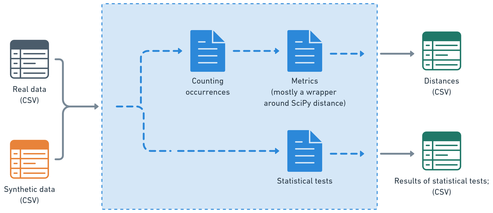

# lpm-fidelity

This repo was forked from [here](https://github.com/inferenceql/lpm.fidelity).

## Disclaimer
This is pre-alpha software. We are currently testing it in real-world scenarios. In its present state, we discourage users from trying it.

## Overview over fidelity component

A library for assessing fidelity between different Polars data frames. 
Fidelity refers to *"[measures] that directly compare a synthetic dataset with a the real one. From
a high-level perspective, fidelity is how well the synthetic data "statistically"
matches the real data"* ([Jordan et al., 2022](https://arxiv.org/pdf/2205.03257)).


## Installation

### Requirements
- Python >=3.12

### As a dependency
Add this line to your `pyproject.toml` file:
```toml
dependencies = [
    "lpm-fidelity @ git+https://github.com/SaferData/lpm-fidelity.git@main"
]
```

Then install with:
```shell
uv sync
```

### Development installation
Clone the repository and install with development dependencies:
```shell
git clone https://github.com/SaferData/lpm-fidelity.git
cd lpm-fidelity
uv sync --all-extras
```

## Usage

:warning: this currently only works with categorical data frames files.

### Using fidelity as a Python library

```python
# Get dependencies.
import polars as pl

from lpm_fidelity.distances import bivariate_distances_in_data
from lpm_fidelity.distances import univariate_distances_in_data
from lpm_fidelity.two_sample_testing import univariate_two_sample_testing_in_data

# Read in two csv files.
df_foo = pl.read_csv("foo.csv")
df_bar = pl.read_csv("bar.csv")

# Compute univariate distance.
df_univariate_distance = univariate_distances_in_data(df_foo, df_bar, distance_metric="tvd")

# Compute bivariate distance.
df_bivariate_distance = bivariate_distances_in_data(df_foo, df_bar, distance_metric="tvd")

# Compute univariate two-sample hypothesis tests (currently only Chi^2).
df_univariate_two_sample_test = univariate_two_sample_testing_in_data(df_foo, df_bar)
```
## Test

Run tests:
```shell
uv run pytest
```

Performance benchmarks are excluded by default. To run them:
```shell
uv run pytest tests/test_distances_performance.py
```
